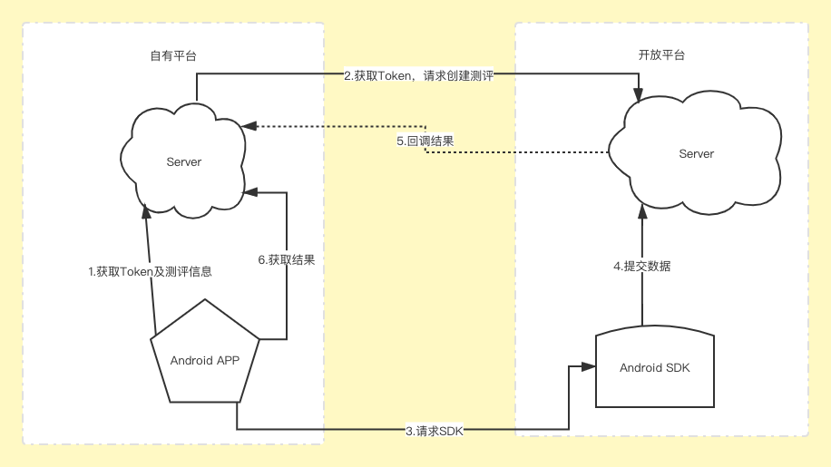

### 简介

### 合规指南

#### **App监管执法合规自查通知**

> **警告** 
>
> 近期App监管执法频繁，已通报12批违规App，累计通报处罚近1000款App，下架近200款逾期不整改的App。
>
> 根据监管执法要求，使用SDK必须在《隐私政策》中告知用户，并做好延迟初始化配置，确保用户同意《隐私政策》后再初始化SDK采数。
>
> 请您务必按照本文档做好合规自查，避免App被通报或下架。

##### 您务必做好以下三步：

1、请务必确保您已经将SDK升级到满足监管新规的最新版本。

2、请务必在《隐私政策》中向用户告知使用SDK，参考条款如下：

使用SDK名称：Open Scale SDK

服务类型：请按SDK功能填写，如数据采集分析

收集个人信息类型：设备信息（IMEI/MAC/Android ID/IDFA/OpenUDID/GUID/SIM卡IMSI/地理位置等）

隐私权政策链接：https://www.zhihanyun.com/page/policy

3、请务必做延迟初始化配置，确保用户授权《隐私政策》后再使用SDK。

#### App检测监管关注重点

> **注意** 
>
> 为了避免您的App被下架，我们强烈建议您参考下文，及时调整合规措施。


|         问题类型                      |            解决方案              |
| :-------------------------------------- | :------------------------------ |
| **违规收集用户个人信息** | **1、私自收集个人信息**问题：在《隐私政策》中向用户明示App、SDK收集个人信息的类型与目的。<br>**2、超范围收集个人信息**问题：确保数据采集均与服务功能相关，所涉个人信息字段均在《隐私政策》公示并得到用户授权。 |
| **违规使用用户个人信息** | **1、私自共享个人信息给第三方**问题：在《隐私政策》向用户告知共享第三方的数据类型及目的，如增加友盟SDK标准隐私条款。<br/>**2、强制用户使用定向推送功能**问题：在《隐私政策》中告知用户定向推荐功能，在定向推荐页面进行显著标识，<br/>并提供关闭定向推荐的选项。 |
|  **不合理索取用户权限**  | **1、不给权限不让用**问题：在《隐私政策》中披露App采集权限及目的。用户拒绝与App功能无关的权限，不得闪退App。<br/>**2、频繁申请权限**问题：用户拒绝权限后不宜频繁（如48小时内）再申请。<br/>**3、过度索取权限**问题：不得采集与App功能无关的权限。 |
|  **为账号注销设置障碍**  | 提供账号注销渠道，15个工作日内响应注销。<br/>账号注销时需要用户提供的信息，不得超过用户注册及使用App期间所提供的信息。 |

#### App隐私政策合规要求

##### 隐私政策范本

《隐私政策》范本可参考[《GB/T 35273-2020 信息安全技术 个人信息安全规范》](http://pip.tc260.org.cn/jbxt/privacy/detail/20200307123754442334)附录D。

##### 合规要求

- 单独成文，用户进入App点击4次以内就能够访问到《隐私政策》。
- 不得默认勾选“同意”，须用户自主选择。
- 须列明App采集的个人信息字段及权限，并对个人敏感信息类型进行显著标识（如加粗/加星/下划线等）。

*个人信息字段详见*[《GB/T 35273-2020 信息安全技术 个人信息安全规范》](http://pip.tc260.org.cn/jbxt/privacy/detail/20200307123754442334)*附录A/B。*

*个人信息权限详见*[《移动互联网应用程序（App）系统权限申请使用指引》](https://www.tc260.org.cn/upload/2020-07-29/1596025980236087507.pdf)*附录A*

- 须列明App与第三方共享个人信息数据的类型及目的，如与SDK的共享情况。与SDK共享的情况，可直接在《隐私政策》中增加 [App监管执法合规自查通知标准隐私协议](#App监管执法合规自查通知)

- 如提供定向推荐功能，须在《隐私政策》中告知用户。
- 如采集儿童类数据，须在《隐私政策》中特殊披露，并说明儿童数据的采集与保护情况。

#### 采集详情

##### 一、个人信息字段采集

我们通过采集唯一设备识别码（如IMEI/android ID/IDFA/OPENUDID/GUID、SIM卡 IMSI 信息）对用户进行唯一标识，以便进行诸如用户身份认证。在特殊情况下（如用户使用平板设备或电视盒子时），无法通过唯一设备识别码标识设备，我们会将设备Mac地址作为用户的唯一标识，以便正常提供统计分析服务。统计分析服务具备基础的反作弊功能，通过获取用户位置信息及IP地址，剔除作弊设备，同时矫正用户的地域分布数据，提高数据的准确性。

##### 二、个人信息权限授予

| 权限                           | 用途                                                         |
| ------------------------------ | ------------------------------------------------------------ |
| ACCESS_NETWORK_STATE（可选）   | 检测联网方式，在网络异常状态下避免数据发送，节省流量和电量。 |
| READ_PHONE_STATE（可选）       | 获取用户设备的IMEI，通过IMEI对用户进行唯一标识，以便提供统计分析服务。 |
| ACCESS_WIFI_STATE（可选）      | 获取WIFI mac地址，在平板设备或电视盒子上，无法通过IMEI标识设备，我们会将WIFI mac地址作为用户的唯一标识，以便正常提供统计分析服务。 |
| INTERNET                       | 允许应用程序联网和发送统计数据的权限，以便提供统计分析服务。 |
| ACCESS_FINE_LOCATION（可选）   | 通过获取位置信息，为开发者提供反作弊功能，剔除作弊设备；同时校正用户的地域分布数据，使报表数据更加准确。 |
| ACCESS_COARSE_LOCATION（可选） | 通过获取位置信息，为开发者提供反作弊功能，剔除作弊设备；同时校正用户的地域分布数据，使报表数据更加准确。 |

#### 联系我们

如您有任何问题，请随时与我们联系。


### 快速开始

#### 环境要求

|          名称           |              版本              |
| :---------------------: | :----------------------------: |
|     Android Studio      |              3.0+              |
| Android SDK Build-tools |           21 及以上            |
|       Android SDK       | Android API 21及以上(安卓 5.0) |
|          Java           |        JDK1.8及以上版本        |
|         Gradle          |        3.0及以上版本SDK        |

​		

#### 导入方式：

**Maven方式**

1. 在工程根目录下的`build.gradle或build.gradle.kts`配置脚本的`allprojects`中添加SDK的Maven仓库地址，如下：

```kotlin
// Groovy DSL:build.gradle
allprojects {
    repositories {
        google()
        jcenter()
        maven { url = "https://mvn.zhihanyun.com/repository/maven-public/" }
    }
}
// Kotlin DSL:build.gradle.kts
allprojects {
    repositories {
        google()
        jcenter()
        maven("https://mvn.zhihanyun.com/repository/maven-public/")
    }
}
```

2. 在项目主工程中的 `build.gradle或build.gradle.kts` 添加远程依赖, 如下:

```kotlin
// Groovy DSL:build.gradle
dependencies {
    implementation "cn.ececloud.android.open:scale:1.0.0"
}

// Kotlin DSL:build.gradle.kts
dependencies {
    implementation("cn.ececloud.android.open:scale:1.0.0")
}
```

**Module方式**

```
1. 下载Module
 - 到官网[Android SDK下载地址](https://www.baidu.com)下载SDK，
 - 如图
```

#### 接入流程



##### SDK调用方式

###### 开启关闭日志

```
EceOpen.enableLog(Boolean)
```

###### 方式一：直接实用集成好的Activity页面

```kotlin
// 参数说明: 
// token: 请求自有服务器获取
// evaluationId: 测评Id，请求自有服务器获取
EceOpen.start(Context, token, evaluationId) 或者 OpenScaleActivity.start(Context, token, evaluationId)

// 示例 开始 MainActivity.kt
override fun initData() {
  super.initData()
	// 点击按钮时候去获取token
  viewBinding.btnNext.setOnClickListener {
    viewModel.getToken()
  }

  // 获取到token后调用sdk唤起页面
  viewModel.token.observe(this) {
    EceOpen.start(this@MainActivity, it.value, evaluationId)
    // OpenScaleActivity.start(this@MainActivity, it.value, evaluationId)
  }
}
// 示例 结束
```

###### 方式二：将答题页面嵌入到自定义Activity中，可自定义ActionBar

```kotlin
// 参数说明: 
// token: 请求自有服务器获取
// evaluationId: 测评Id，请求自有服务器获取
EceOpen.fragment(token, evaluationId) 或者 OpenScaleFragment.newInstance(token, evaluationId)

// 示例 开始
// 第一步  自定义Activity将OpenScaleFragment嵌入其中
class CustomActionBarActivity : AppCompatActivity() {
    
    override fun onCreate(savedInstanceState: Bundle?) {
        super.onCreate(savedInstanceState)
      	setContentView(R.layout.activity_custom_action_bar)
        supportFragmentManager
            .beginTransaction()
            .replace(R.id.fragment, EceOpen.fragment(it.value, evaluationId))
            //.replace(R.id.fragment, OpenScaleFragment.newInstance(it.value, evaluationId))
            .commit() 
    }   
}

// 第二步 获取token，唤起页面
override fun initData() {
  super.initData()

  // 点击按钮时候去获取token
  viewBinding.btnNext.setOnClickListener {
    viewModel.getToken()
  }

  // 获取到token后调用sdk唤起页面
  viewModel.token.observe(this) {
    startActivity(Intent(this, CustomActionBarActivity::class.java))
  }
}
// 示例 结束
```

###### 关于页面色调

SDK使用到的资源文件(string、color、drawable等) 均以`ece_`开头，可通过在app项目中新建同名资源文件重写。其中：

```xml
# color
<color name="ece_color_primary">#FB834D</color> # 主色调, sdk中为橙色
<color name="ece_color_secondary">#FEF4F0</color> # 副色调， sdk中为淡橙色
<color name="ece_color_disable">#FFE6DA</color> #  按钮不可用， sdk中为浅橙色
# drawable
# ece_ic_previous_disable 上一题不可点状态
# ece_ic_previous_normal 上一题正常状态
# ece_ic_next_disable 下一题不可点状态
# ece_ic_next_normal  下一题正常状态
# ece_back 返回按钮
# ece_ic_answer  答题进度图 size:60x60

```

###### 使用的库

```kotlin
// kotlin：1.4.32
// kotlinx-coroutines-android：1.4.3
// lifecycle-livedata-ktx：2.2.0
// lifecycle-viewmodel-ktx：2.2.0


// okhttp: com.squareup.okhttp3:okhttp:4.9.1
// retrofit:com.squareup.retrofit2:retrofit:2.9.0
// onverter-gson:com.squareup.retrofit2:converter-gson:2.9.0

```


#### 混淆

```
-keep class cn.ececloud.android.open.**{
    *;
}
-keep interface cn.ececloud.android.open.**{
    *;
}
-dontwarn cn.ececloud.android.open.**
```

